# POSTMAN DOCUMENTATION

## 1.Users Endpoint

### SUCCESS RESPONSE:

-   Register
    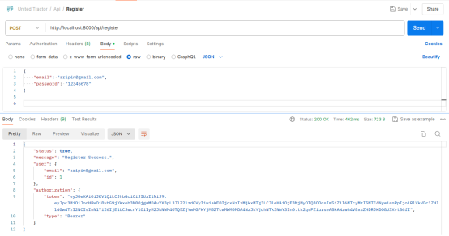

-   Login
    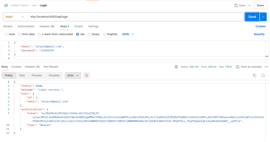

### ERROR RESPONSE:

-   Register, if required data not filled.
    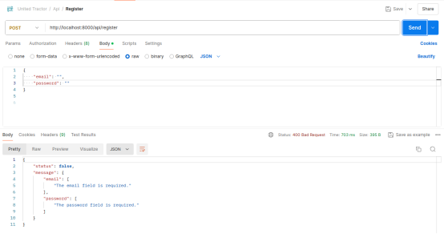

-   Register, if email or password is invalid.
    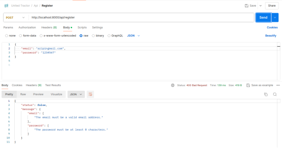

-   Register, if email already exist.
    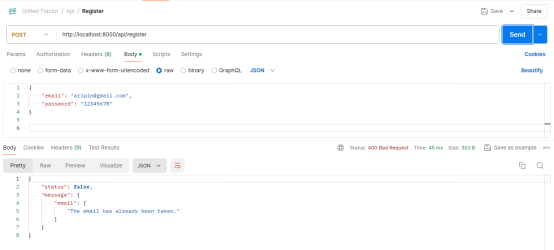

-   Login, if required data not filled.
    

-   Login, if username or password invalid.
    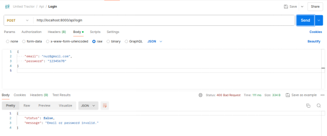

## 2. Product Categories Endpoint

### SUCCESS RESPONSE:

-   Create
    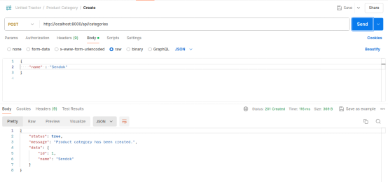

-   Get All
    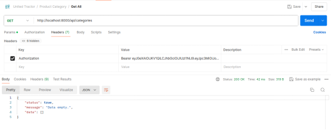
    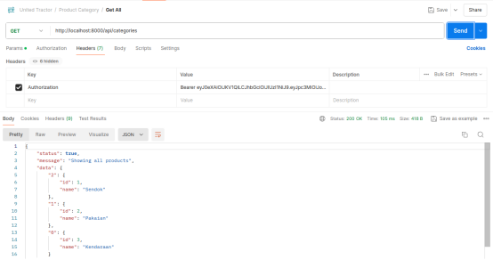

-   Get By Id
    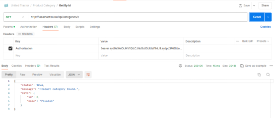

-   Update By Id
    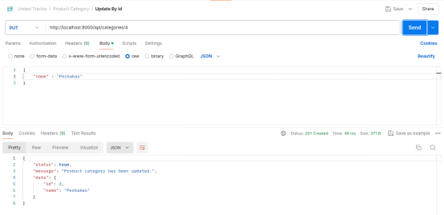

-   Delete By Id
    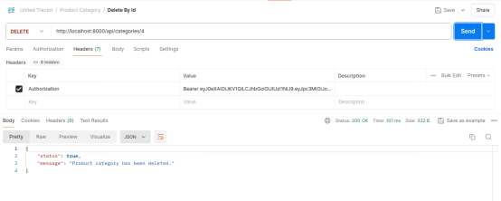

### ERROR RESPONSE:

-   Access to product categories endpoints requires authentication, otherwise, an authentication error will be thrown.
    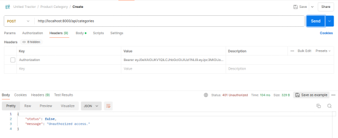

-   Create, if required data not filled.
    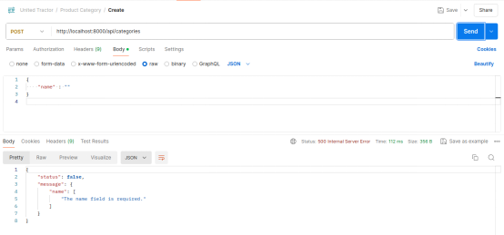

-   Create, if category is already exist.
    

-   Find By Id, Update By Id, and Delete By Id operations require an Id to be provided, if data with id provided not found an error will be thrown.
    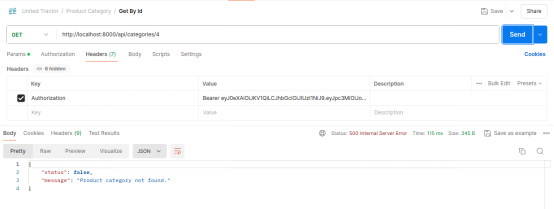

## 3.Products Endpoint

### SUCCESS RESPONSE:

-   Create
    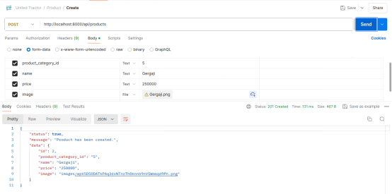

-   Get All
    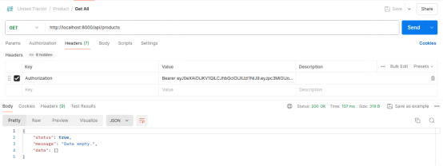
    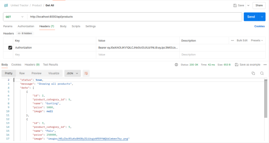

-   Get By Id
    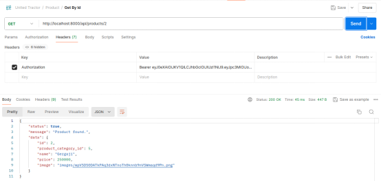

-   Update By Id
    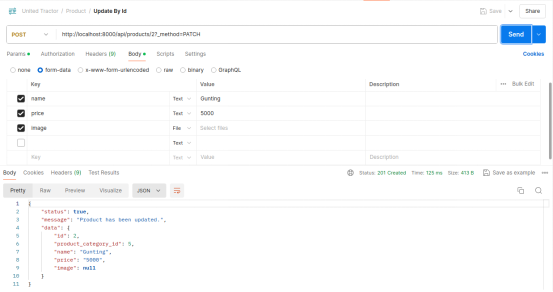

-   Delete By Id
    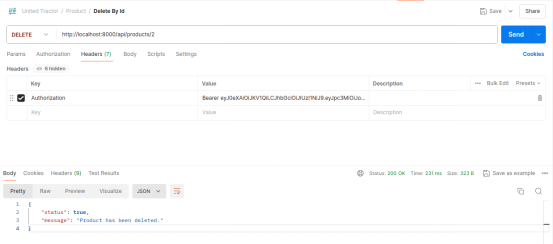

## ERROR RESPONSE:

-   Access to products endpoints requires authentication, otherwise, an authentication error will be thrown.
    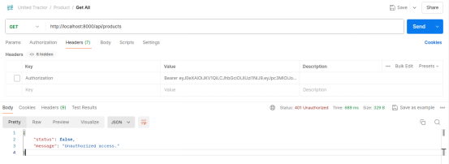

-   Create, if required data not filled.
    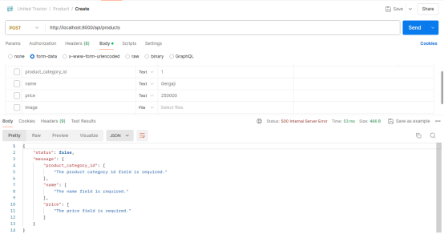

-   Create, if product name already exist or category not found.
    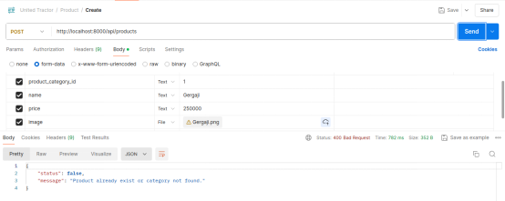

-   Find By Id, Update By Id, and Delete By Id operations require an Id to be provided, if data with id provided not found an error will be thrown.
    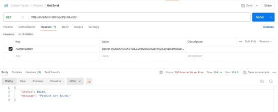
